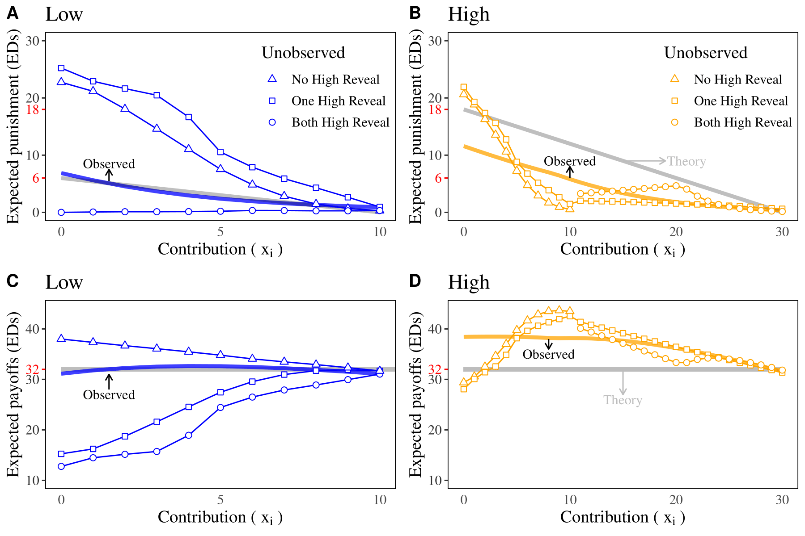

# NormEnforcement

Replication materials for "Norm enforcement with incomplete information" (with David C. Kingsley). Journal of Economic Behavior & Organization 189 (2021): 403-430. [(Link)](https://www.sciencedirect.com/science/article/pii/S0167268121002274?casa_token=rWrkyqIfdcIAAAAA:MT6OkwHfJCUSI8JmR2AswQJbIldmKW0jCJINQIWc_aSlkEv9YixmxsQ9S5g0oPnqF5y1SCsux_4)

